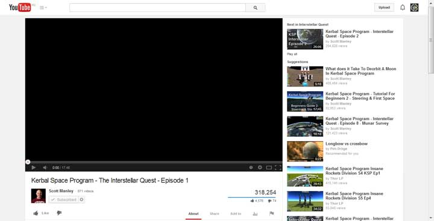
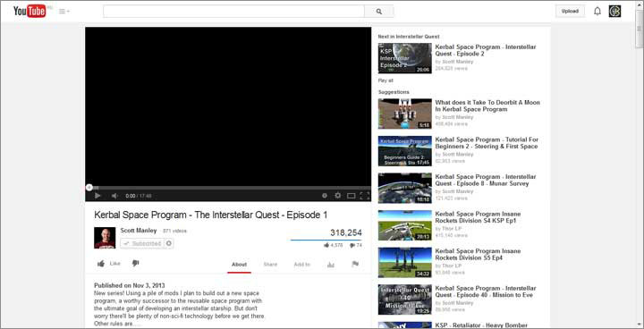

youtube_smaller
===============

Resize the Youtube player to the old, smaller size using this Greasemonkey userscript.

Recently (June, 2014) Youtube introduced a "feature" to dynamically resize the player according to the window size. I found this quite annoying as I was used to the previous configuration. So I set out to write a script that overrides the CSS @media quieries and bring back the good old smaller player.

*Before & after:*

Tutorial of installation here: https://www.youtube.com/watch?v=jJus7CQvfqc

This script works with the following browsers (and plugins):

* Mozilla Firefox (Greasemonkey)
* Google Chrome (Tampermonkey)
* Opera (Violentmonkey)

Others are yet to be tested. Make sure to use the latest browsers.

(At version 1.6, this project was transferred to Github, enabling automatic updates, issue tracking, etc.)